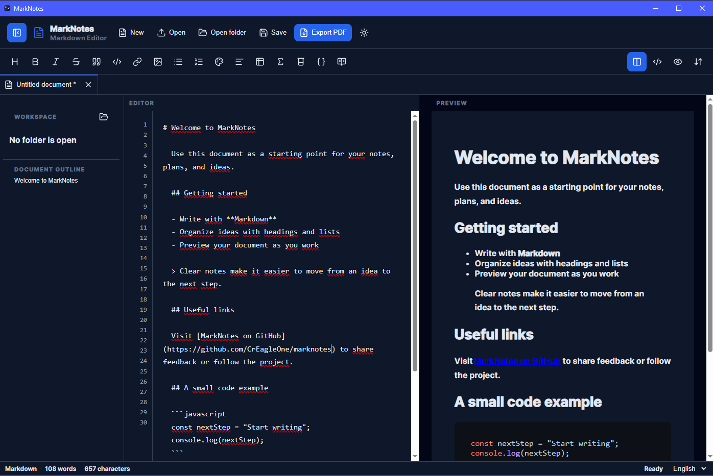
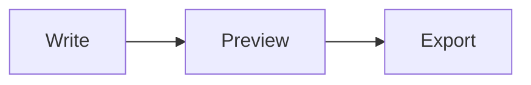

<p align="center">
    
</p>

<h1 align="center">MarkNotes</h1>

<p align="center">
    <a href="https://github.com/CrEagleOne/marknotes/actions/workflows/ci.yml"></a>
    <a href="https://github.com/CrEagleOne/marknotes/releases"></a>
    
    
</p>

MarkNotes is a user-friendly Markdown editor for writing, previewing, and exporting technical and scientific documents.

It combines a focused writing interface with live rendering for Markdown, mathematics, chemistry, source code, and Mermaid diagrams. The application supports both desktop and browser environments.



## Features

- Write Markdown with a live preview.
- Switch between split, editor-only, and preview-only views.
- Format content from a convenient toolbar.
- Insert headings, quotations, links, images, lists, code blocks, and tables.
- Write inline and display mathematics with KaTeX.
- Write chemical equations with `mhchem` syntax.
- Create diagrams with Mermaid.
- Apply text colors and alignment.
- Generate a table of contents from document headings.
- Navigate quickly with the document outline.
- Open and save Markdown files.
- Browse Markdown files in an opened folder and edit several documents in tabs.
- Close any editor tab; the final tab is replaced by a new empty document.
- Save and restore a folder workspace from `.marknotes/workspace.json` at its root.
- Automatically save local file changes shortly after typing stops.
- Export documents to PDF through the system print dialog.
- Use light and dark themes.
- Switch between English and French.
- Automatically preserve the current document in local storage.

## Getting started

1. Launch MarkNotes.
2. Start writing in the **Editor** panel.
3. Review the rendered result in the **Preview** panel.
4. Use the toolbar to insert or format content.
5. Save your work as a Markdown file when finished.

The application opens with a sample scientific document so that you can immediately explore its main features.

## Installation

Download the installer for your platform from the project release or CI artifacts, then run it:

- **Windows:** use either the `.msi` installer or the NSIS `.exe` installer.
- **macOS:** open the distributed application bundle and move it to `Applications` when applicable.
- **Linux:** install the `.deb` package on Debian-based distributions, or run the `.AppImage` package.

> **Unsigned builds**
>
> Current desktop builds are **not code-signed**. This does not mean that the installer is malicious, but Windows SmartScreen or macOS Gatekeeper can warn about or prevent the first launch because the operating system cannot verify the publisher.
>
> Only continue when the installer was obtained from a trusted project release or CI artifact. On a managed work computer, security policies can still block the application; contact your IT administrator rather than attempting to bypass those policies.

## Development

### Prerequisites

- Node.js 22 or later and npm
- Rust stable, installed with [rustup](https://rustup.rs/)
- The platform prerequisites required by Tauri:
    - **Windows:** Microsoft C++ Build Tools and WebView2 Runtime
    - **macOS:** Xcode Command Line Tools
    - **Linux (Debian/Ubuntu):** `libwebkit2gtk-4.1-dev`, `libayatana-appindicator3-dev`, `librsvg2-dev`, and `patchelf`

### Setup and commands

Install the frontend dependencies:

```sh
npm ci
```

Run the browser development server:

```sh
npm run dev
```

Run the desktop application with Tauri hot reload:

```sh
npm run desktop:dev
```

Create production desktop installers:

```sh
npm run desktop:build
```

Run the checks used by CI before opening a pull request:

```sh
npm run build
npm run check:modules
cargo fmt --manifest-path src-tauri/Cargo.toml -- --check
cargo clippy --manifest-path src-tauri/Cargo.toml --all-targets -- -D warnings
cargo test --manifest-path src-tauri/Cargo.toml
```

## Interface overview

### Header

The header provides the main document actions:

- **New** creates an empty document.
- **Open** loads a Markdown, Markdown Text, or plain-text file.
- **Open folder** displays a recursive tree of Markdown files in the selected folder.
- **Save** saves the current document as a `.md` file.
- **Save workspace** creates or updates `.marknotes/workspace.json` in the opened folder. It remembers the files open in tabs; their contents remain saved in their own Markdown files.
- **Export PDF** opens the system print dialog for PDF export.
- **Theme** switches between light and dark mode.
- **Sidebar** shows or hides the document navigation panel.

Open document names are displayed in their editor tabs.

### Folder workspaces

Use **Open folder** to work on a collection of notes. The sidebar lists only Markdown (`.md`, `.markdown`) and text (`.txt`) files while preserving their folder hierarchy. Selecting a file opens it in a new editor tab, or activates its existing tab when it is already open.

Use **Save workspace** to store the open-file list in the hidden `.marknotes` folder at the selected folder's root. Opening the same folder later restores those tabs.

### Formatting toolbar

The toolbar includes shortcuts for:

- Headings from level 1 to level 6
- Bold, italic, and strikethrough text
- Blockquotes
- Code blocks
- Links and images
- Bulleted and numbered lists
- Text color
- Text alignment
- Tables
- Inline formulas
- Chemical equations
- Mermaid diagrams
- Table of contents generation

The view controls on the right let you choose between:

- **Split view** — editor and preview side by side
- **Editor only** — distraction-free writing
- **Preview only** — rendered document only

### Document outline

The sidebar automatically lists the headings found in the current document. Select a heading to jump directly to its position in the editor.

The sidebar also provides shortcuts for inserting scientific content.

### Status bar

The status bar displays:

- The current word count
- The current character count
- The application status
- The language selector

## Writing Markdown

MarkNotes supports GitHub Flavored Markdown, including tables and common formatting syntax.

### Headings

```markdown
# Main title
## Section
### Subsection
```

### Text formatting

```markdown
**Bold text**
_Italic text_
~~Strikethrough text~~
```

### Lists

```markdown
- First item
- Second item

1. First step
2. Second step
```

### Links and images

```markdown
[Link text](https://example.com)


```

### Blockquotes

```markdown
> This is a blockquote.
```

### Code blocks

Use fenced code blocks and optionally specify a language for syntax highlighting:

````markdown
```javascript
const message = "Hello, Markdown!";
console.log(message);
```
````

## Scientific content

### Inline mathematics

Wrap an expression in single dollar signs:

```markdown
Einstein's equation is $E=mc^2$.
```

### Display mathematics

Wrap an expression in double dollar signs:

```markdown
$$
\frac{-b \pm \sqrt{b^2 - 4ac}}{2a}
$$
```

### Chemical equations

Use the `\ce{}` command inside a display formula:

```markdown
$$
\ce{2H2 + O2 -> 2H2O}
$$
```

### Mermaid diagrams

Create a fenced code block with the `mermaid` language:

````markdown

````

If a diagram contains invalid Mermaid syntax, the preview displays an error message instead of the diagram.

## Creating tables

1. Place the cursor where the table should be inserted.
2. Select the **Table** button in the toolbar.
3. Choose the number of rows and columns.
4. Enable or disable the header row.
5. Select the alignment for each column.
6. Select **Insert**.

With a header row enabled, the application inserts a standard Markdown table. Without a header row, it inserts an HTML table so that column alignment can still be preserved.

## Creating a table of contents

1. Structure the document with Markdown headings.
2. Place the cursor where the table of contents should appear.
3. Select the **Table of contents** button.

The generated list includes headings below level 1 and links to their corresponding sections.

## Opening files

MarkNotes accepts the following file types:

- `.md`
- `.markdown`
- `.txt`

In the desktop application, the native file picker is used. In the browser, the standard browser file picker is used.

## Saving files

Select **Save** to save the current document as a Markdown file.

- In the desktop application, you can choose the destination with the native save dialog.
- In the browser, the file is downloaded through the browser.

Characters that are not valid in file names are replaced automatically.

## Exporting to PDF

1. Select **Export PDF**.
2. Choose a PDF printer or **Save as PDF** in the system print dialog.
3. Select the destination and save the document.

Only the rendered document is included in the printable output.

## Automatic local recovery

The current document, selected language, and theme are stored locally while you work. When you reopen the application in the same environment, the most recently stored document is restored automatically.

> Local recovery is a convenience feature, not a replacement for saving important documents as files.

## Language and theme

Use the language selector in the status bar to switch between:

- English
- French

Use the sun or moon button in the header to switch between light and dark mode.

## Security and privacy

Markdown rendering is sanitized before it is displayed. Mermaid uses strict security settings, and KaTeX trust mode is disabled.

Documents are processed in the application. The automatic recovery copy is stored in the local application or browser storage.

## Troubleshooting

### A Mermaid diagram is not displayed

Check that:

- The code block language is exactly `mermaid`.
- The diagram follows valid Mermaid syntax.
- The opening and closing code fences both contain three backticks.

### A formula is not rendered

Check that:

- Inline formulas use one dollar sign on each side.
- Display formulas use two dollar signs before and after the expression.
- LaTeX commands use the correct backslash syntax.

### A chemical equation is not rendered

Make sure the equation uses `\ce{}` inside a mathematical block:

```markdown
$$
\ce{H2O}
$$
```

### My latest content was restored unexpectedly

MarkNotes automatically restores the document stored in the local environment. Select **New** to start with an empty document, then save it under a new name.

### The PDF layout is not what I expected

Review the paper size, margins, orientation, and scaling options in the system print dialog before saving the PDF.

## Supported content at a glance

| Content | Support |
| --- | --- |
| Standard Markdown | Yes |
| GitHub Flavored Markdown | Yes |
| Syntax-highlighted code | Yes |
| KaTeX mathematics | Yes |
| `mhchem` chemistry | Yes |
| Mermaid diagrams | Yes |
| Markdown tables | Yes |
| HTML tables without headers | Yes |
| Light and dark themes | Yes |
| English and French interface | Yes |
| Desktop file dialogs | Yes |
| Browser file download | Yes |
| PDF export through printing | Yes |

## Contributing

Contributions, bug reports, and feature suggestions are welcome. When reporting a problem, include:

- The environment used: desktop or browser
- The steps needed to reproduce the issue
- The expected result
- The actual result
- A small Markdown example, when relevant

Please avoid including confidential or personal information in public issues.

## License

Add the license selected for this project to a `LICENSE` file in the repository, then update this section with the license name.
